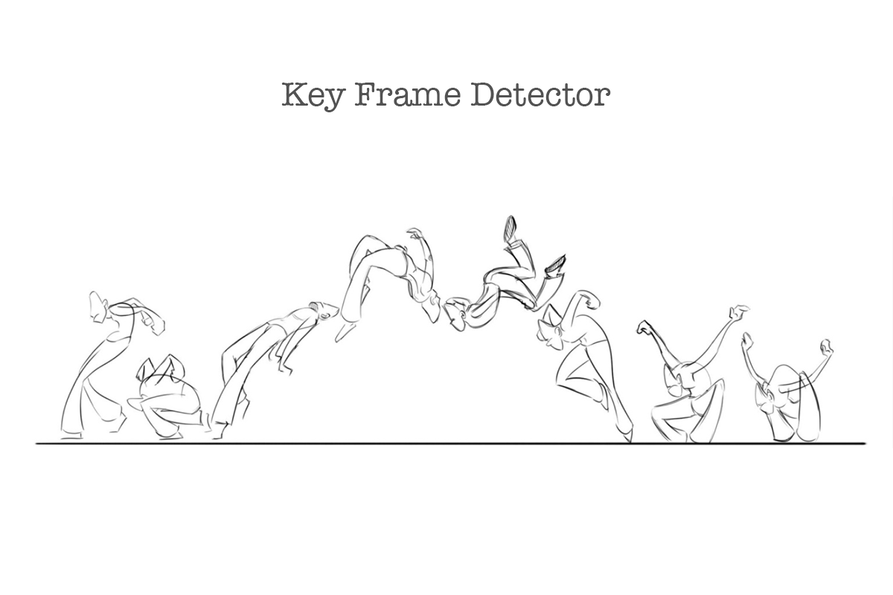

<center>

   
    
</center>

A `Key Frame` is a location on a video timeline which marks the beginning or end of a smooth transition throughout the fotograms, `Key Frame Detector` try to look for the most representative and significant frames that can describe the movement or main events in a video using peakutils peak detection functions.

<br/>
<p align="center">

    

</p>
<br/>

## Installation

**Requirements**

- python3
- numpy
- opencv
- peakutils
- matplotlib
- PIL

```python
pip install key-frame-detector
```


